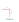
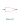
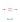
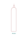
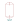

# PI&D KiCAD Symbols

## burst-disks

### Burst Disk - Pressure.svg

### Burst Disk - Vacuum.svg

## engines

### Engine - Bipropellant.svg

### Engine - Hybrid.svg

### Engine - Solid.svg

## filters

### Filter - Conical.svg

### Filter.svg

## fittings

### Cap.svg

### Cross.svg

### Elbow.svg

### Flexible Hose.svg

### Reducer 2.svg

### Reducer.svg

### Tee.svg

## instruments

### Coriolis Flow Meter.svg

### Flow Indicator.svg

### Flow Transmitter.svg

### Level Indicator.svg

### Level Transmitter.svg

### Pressure Gauge.svg

### Pressure Indicator.svg

### Pressure Switch.svg

### Pressure Transducer.svg

### RTD.svg

### Thermocouple.svg

## pumps

### Pump.svg

## pyrotechnics

### Pyro Valve NC.svg

### Pyro Valve NO.svg

### Squib.svg

## quick-disconnects

### Quick Disconnect - Both Sealed.svg

### Quick Disconnect - Destination Sealed.svg

### Quick Disconnect - No Sealing.svg

### Quick Disconnect - Source Sealed.svg

## regulators

### Back Pressure Regulator.svg

### Pressure Regulator.svg

## restrictions

### Cavitating Venturi.svg

### Restriction Orifice.svg

## valves

### Valve - 3 Way Ball.svg

### Valve - 3 Way Globe.svg

### Valve - 3 Way.svg

### Valve - 4 Way.svg

### Valve - Angle Ball 2.svg

### Valve - Angle Ball.svg

### Valve - Angle Globe.svg

### Valve - Ball Hydraulic.svg

### Valve - Ball Manual.svg

### Valve - Ball Pneumatic.svg

### Valve - Ball Servo.svg

### Valve - Ball.svg

### Valve - Butterfly Hydraulic.svg

### Valve - Butterfly Manual.svg

### Valve - Butterfly Pneumatic 2.svg

### Valve - Butterfly Pneumatic.svg

### Valve - Butterfly Servo.svg

### Valve - Butterfly.svg

### Valve - Check.svg

### Valve - Diaphragm Hydraulic.svg

### Valve - Diaphragm Manual.svg

### Valve - Diaphragm Pneumatic.svg

### Valve - Diaphragm Servo.svg

### Valve - Diaphragm.svg

### Valve - Gate Hydraulic.svg

### Valve - Gate Manual.svg

### Valve - Gate Pneumatic.svg

### Valve - Gate Servo.svg

### Valve - Gate.svg

### Valve - Globe Hydraulic.svg

### Valve - Globe Manual.svg

### Valve - Globe Pneumatic.svg

### Valve - Globe Servo 2.svg

### Valve - Globe Servo.svg

### Valve - Globe.svg

### Valve - Needle Hydraulic.svg

### Valve - Needle Manual.svg

### Valve - Needle Pneumatic.svg

### Valve - Needle Servo.svg

### Valve - Needle.svg

### Valve - Pressure Relief.svg

### Valve - Pressure and Vacuum Relief.svg

## vents

### Vent - Covered.svg

### Vent - Uncovered.svg

## vessels

### Bottle - Dip Tube 2.svg

### Bottle - Dip Tube.svg

### Bottle - Large.svg

### Bottle - Small 2.svg

### Bottle - Small.svg

### Bottle.svg

### Sample Cylinder.svg

### Tank - Horizontal.svg

### Tank - Large.svg

### Tank - Small.svg

### Tank - Sphere.svg

### Tank.svg

